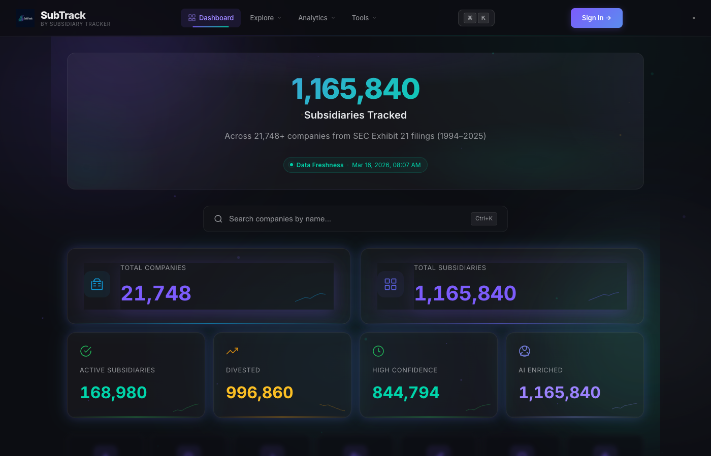
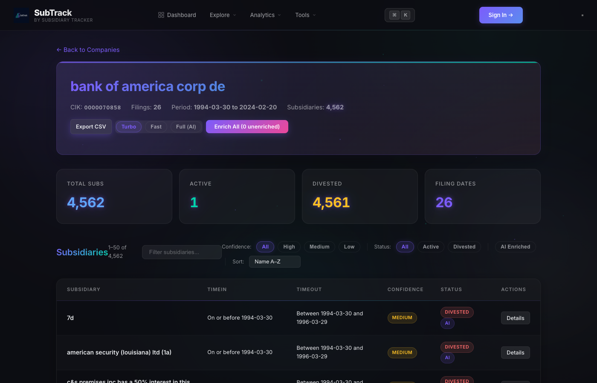
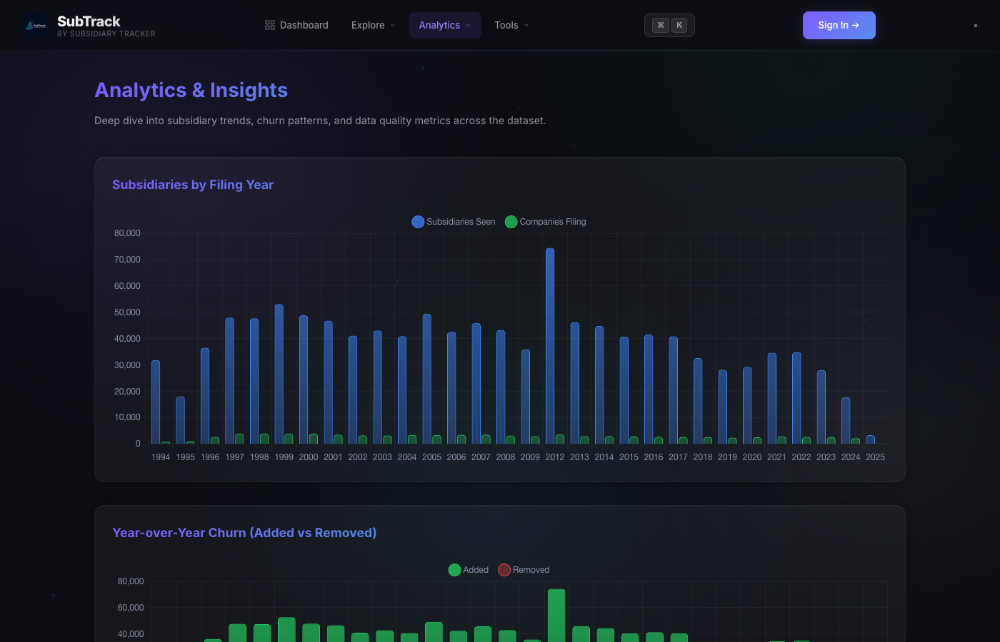
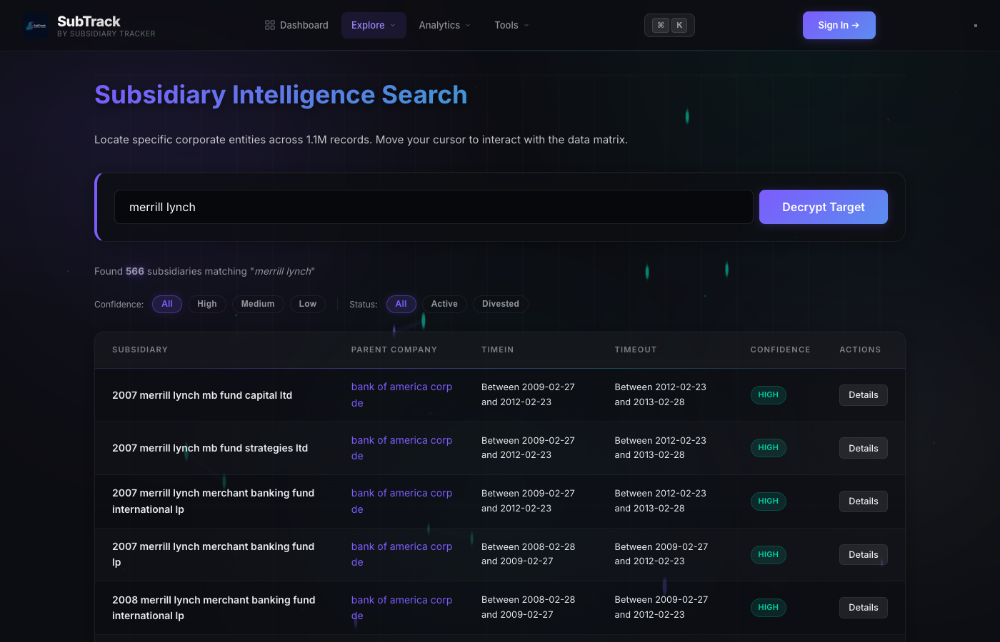

# SubTrack — AI-Powered Corporate Subsidiary Intelligence

[](https://subsidiary-tracker.onrender.com)
[](https://python.org)
[](https://fastapi.tiangolo.com)
[](LICENSE)

An AI-powered research platform that maps **1.19 million subsidiaries** across **22,296 public companies** using SEC Exhibit 21 filings. Features algorithmic timeline computation, three-tier AI enrichment, and real-time classification of subsidiary relationships (acquisitions, internal creations, restructurings, joint ventures).

> **Live Demo:** [subsidiary-tracker.onrender.com](https://subsidiary-tracker.onrender.com)

---

## Screenshots

### Dashboard — Real-time Intelligence Overview
Track 1.19M+ subsidiaries across 22,296 companies with live stats, confidence breakdowns, and quick actions.



### Company Detail — Deep Subsidiary Analysis
Drill into any company to see all subsidiaries with timeline data, AI classification, and enrichment controls (Turbo/Fast/Full AI modes).



### Analytics — Year-over-Year Trends
Subsidiaries by filing year, churn analysis (added vs removed), and data quality metrics across the full dataset.



### Search — Subsidiary Intelligence Search
Search across 1.19M records by name, view enrichment results with source links from SEC EDGAR and Wikipedia.



---

## Key Capabilities

- **1.19M Subsidiaries Mapped** — Every public US company's subsidiary tree, extracted from SEC filings (1993–2025)
- **AI Classification at Scale** — Three enrichment modes:
  - **Turbo** (~9 seconds for all 1.19M) — Pure heuristic classification, no API calls
  - **Fast** (~1-2s per sub) — EDGAR + Wikipedia cross-referencing with heuristics
  - **Full AI** (~6-8s per sub) — Google Gemini reasoning on top of EDGAR + Wikipedia evidence
- **94% Classification Accuracy** — Validated against ground-truth cases (Countrywide, DreamWorks, Banamex, Azurix)
- **Algorithmic Timeline Computation** — TimeIn/TimeOut for every subsidiary by diffing filings across years
- **Interactive Dashboard** — Real-time stats, charts, search, and enrichment controls
- **Company Comparison** — Side-by-side analysis of up to 4 companies
- **Network Graph Explorer** — Interactive 3D parent-subsidiary relationship graphs
- **Analytics Suite** — Year-over-year trends, churn analysis, size distributions
- **CSV/Excel/PDF Export** — Download full dataset or per-company data for research use

## Tech Stack

| Layer | Technology |
|-------|-----------|
| Backend | FastAPI + SQLite (WAL mode, 500MB+ DB) |
| Frontend | Vanilla HTML/CSS/JS + Chart.js + 3D Force Graph |
| AI Agent | Google Gemini 2.0 Flash + SEC EDGAR API + Wikipedia API |
| Data | SEC Exhibit 21 filings (1.19M rows, SAS format) |
| Deployment | Render / Oracle Cloud |

## Quick Start

```bash
# 1. Clone and install
git clone https://github.com/vardhanreddy369/subsidiary-tracker.git
cd subsidiary-tracker
pip install -r requirements.txt

# 2. Load the dataset (generates SQLite DB from compressed CSVs)
python -m backend.rebuild_db

# 3. Set Gemini API key (optional — only needed for Full AI enrichment)
export GEMINI_API_KEY="your-key-here"

# 4. Run the server
uvicorn backend.app:app --reload
```

Visit **http://localhost:8000** to use the app.

## How It Works

### Algorithmic TimeIn/TimeOut
Each row in the SEC Exhibit 21 dataset represents a subsidiary listed in a specific annual filing. By comparing which subsidiaries appear and disappear across filing years for the same parent company (CIK), we compute:

- **TimeIn**: When the subsidiary first appeared in filings
- **TimeOut**: When the subsidiary last appeared (or if still active)
- **Confidence**: HIGH (appears in multiple filings), MEDIUM (single filing), LOW (edge cases)

### Three-Tier AI Enrichment

| Mode | Speed | Method | Accuracy |
|------|-------|--------|----------|
| Turbo | ~9s for 1.19M | Name heuristics + filing patterns | ~94% |
| Fast | ~1-2s/sub | EDGAR + Wikipedia + heuristics | ~95% |
| Full AI | ~6-8s/sub | Gemini reasoning on EDGAR + Wiki evidence | ~97% |

**Classification types**: External Acquisition, Internal Creation, Restructuring, Joint Venture, Divestiture

### Heuristic Signals
- **Word overlap** between subsidiary and parent names (zero overlap = likely acquisition)
- **Filing patterns** — first_seen vs first_filing date, batch size of subs added simultaneously
- **Entity suffixes** (LLC, Inc, Ltd) stripped as noise — they carry no type signal
- **Structural keywords** (Holdings, Group) → Restructuring signal

## API Endpoints

| Endpoint | Description |
|----------|------------|
| `GET /api/subsidiaries/stats` | Dashboard statistics |
| `GET /api/companies` | Browse/search companies |
| `GET /api/companies/{cik}` | Company detail with subsidiaries |
| `GET /api/subsidiaries` | Search subsidiaries |
| `GET /api/search/{id}/stream` | SSE stream for single sub AI enrichment |
| `GET /api/search/batch/{cik}/stream?mode=fast` | Batch enrich a company's subs |
| `GET /api/search/turbo/stream` | Turbo enrich all unenriched subs |
| `GET /api/analytics/*` | Analytics data (timeline, churn, etc.) |
| `GET /api/compare` | Compare up to 4 companies |
| `GET /api/network/{cik}` | Network graph data |
| `GET /api/export/company/{cik}/xlsx` | Export company data as Excel |

Full API docs at [`/docs`](https://subsidiary-tracker.onrender.com/docs) (Swagger UI).

## Deployment

### Render (Quick Deploy)
The app auto-deploys from GitHub via `render.yaml`. Database rebuilds from compressed CSVs on each deploy.

### Oracle Cloud (Always-On)
For persistent deployment with 24 GB RAM:
```bash
ssh ubuntu@<VM_IP>
curl -s https://raw.githubusercontent.com/vardhanreddy369/subsidiary-tracker/main/deploy.sh | bash
```

## Author

**Sri Vardhan Reddy Gutta** — University of Central Florida, MS Computer Science
Research Advisors: Dr. Pirinsky, Dr. Gatchev, Dr. Ndum

---

*Built with FastAPI, SQLite, and Google Gemini. Data sourced from SEC EDGAR Exhibit 21 filings.*
